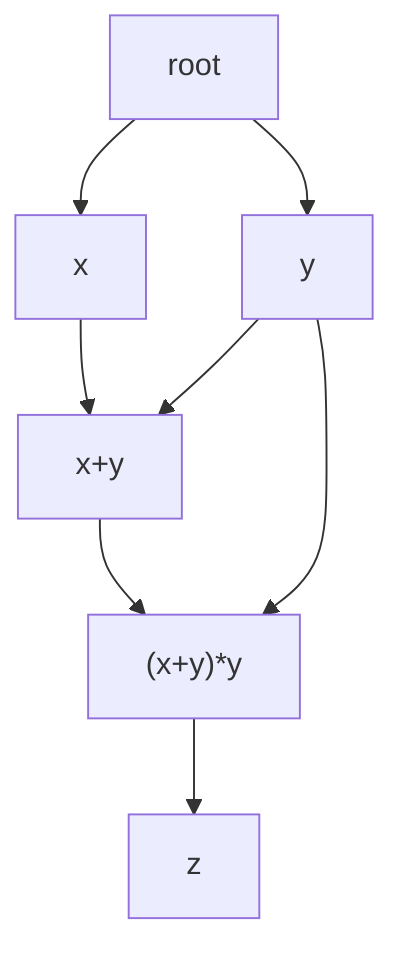

```mermaid
graph
0xc73000580["z"]
0xc730004c0-->0xc73000580
0xc73000400["x+y"]
0xc73000280-->0xc73000400
0xc73000340-->0xc73000400
0xc73000280["x"]
0xc73000100-->0xc73000280
0xc730004c0["(x+y)*y"]
0xc73000400-->0xc730004c0
0xc73000340-->0xc730004c0
0xc73000100["root"]
0xc73000340["y"]
0xc73000100-->0xc73000340
```